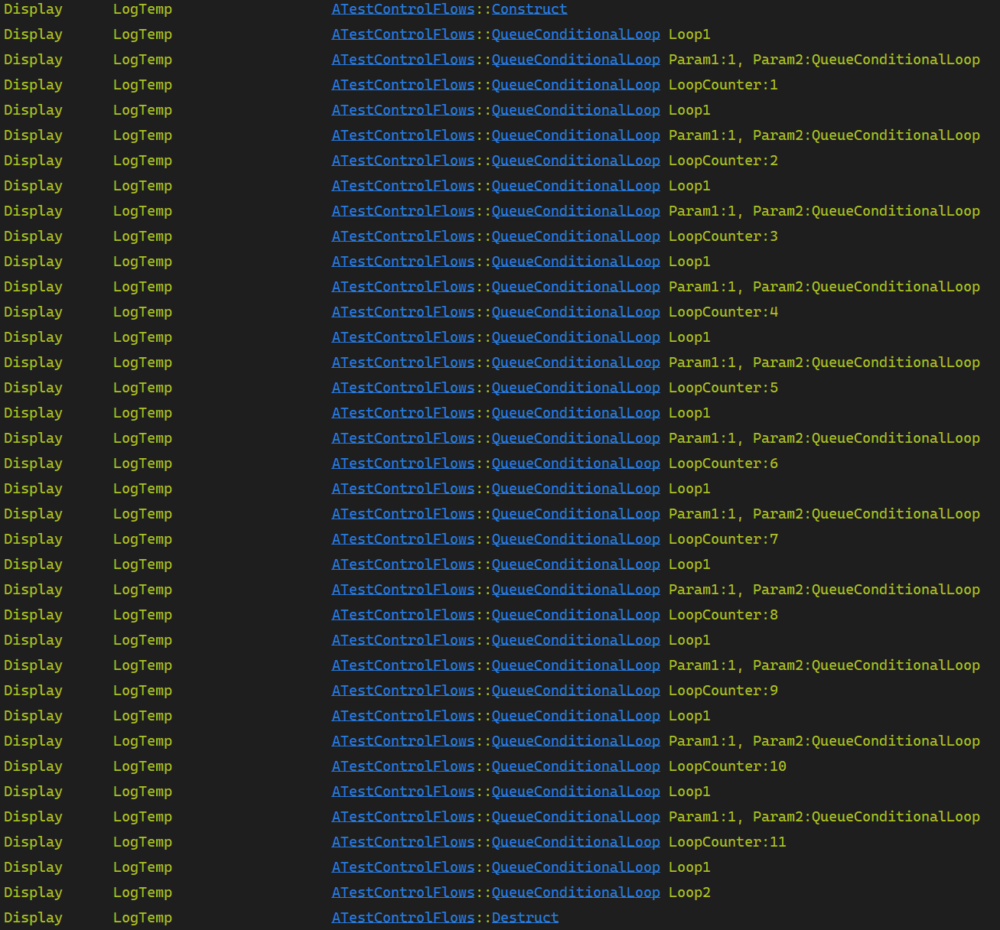

# QueueConditionalLoop



### 代码


```cpp
FControlFlow& Flow = FControlFlowStatics::Create(this, TEXT("TestQueueConditionalLoop"))
.QueueStep(TEXT("ConstructNode"), this, &ThisClass::Construct)
//do while
.Loop([this](TSharedRef<FConditionalLoop> InnerLoop)
{
	UE_LOG(LogTemp, Display, TEXT("ATestControlFlows::QueueConditionalLoop Loop1"));

	InnerLoop->RunLoopFirst().QueueStep(TEXT("QueueConditionalLoop"), this, &ThisClass::QueueConditionalLoop, 1, FString("QueueConditionalLoop"));
	
	return LoopCounter <= 10 ? EConditionalLoopResult::RunLoop : EConditionalLoopResult::LoopFinished;
})
//while
.Loop([this](TSharedRef<FConditionalLoop> InnerLoop)
{
	UE_LOG(LogTemp, Display, TEXT("ATestControlFlows::QueueConditionalLoop Loop2"));
	
	InnerLoop->CheckConditionFirst().QueueStep(TEXT("QueueConditionalLoop"), this, &ThisClass::QueueConditionalLoop, 1, FString("QueueConditionalLoop"));
	
	return LoopCounter <= 10 ? EConditionalLoopResult::RunLoop : EConditionalLoopResult::LoopFinished;
})
.QueueStep(TEXT("DestructNode"), this, &ThisClass::Destruct);

Flow.ExecuteFlow();
```


<figure><figcaption></figcaption></figure>



## 日志

<figure><figcaption></figcaption></figure>



## QueueStep执行堆栈

<figure><figcaption></figcaption></figure>



## ExecuteFlow执行堆栈

<figure><figcaption></figcaption></figure>


